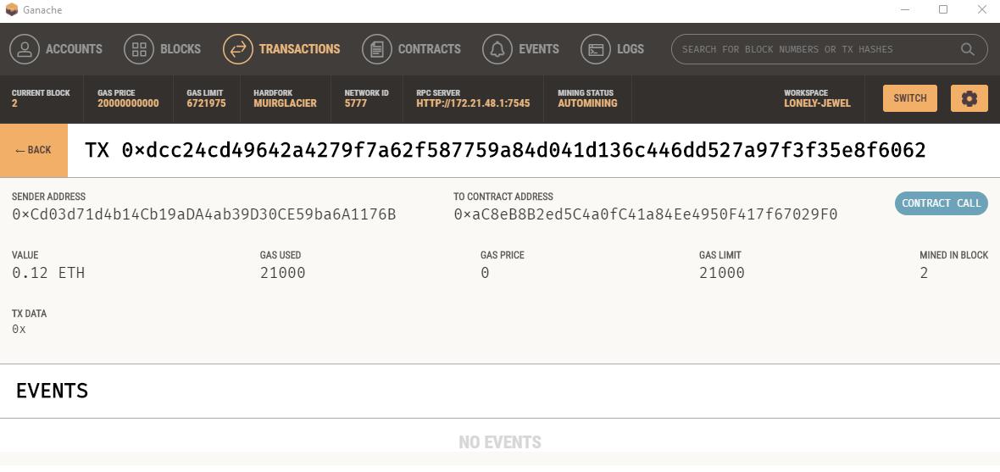

## Cryptocurrency Wallet

Fintech Finder is an application that its customers can use to find fintech professionals from among a list of candidates, hire them, and pay them. Integrate the Ethereum blockchain network into the application in order to enable your customers to instantly pay the fintech professionals whom they hire with cryptocurrency.

## Assumptions:

* Generate a new Ethereum account instance by using the mnemonic seed phrase provided by Ganache.

* Fetch and display the account balance associated with your Ethereum account address.

* Calculate the total value of an Ethereum transaction, including the gas estimate, that pays a Fintech Finder candidate for their work.

* Digitally sign a transaction that pays a Fintech Finder candidate, and send this transaction to the Ganache blockchain.

* Review the transaction hash code associated with the validated blockchain transaction.

## Submission

Account balance after payment:

Transaction:

